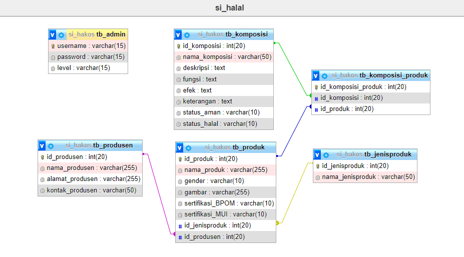

<p align="center"><a href="https://github.com/ZuyinatinK/pengecekan-produk-kosmetik"></a></p>
<h1 align="center">Cosmetics Safety | Sistem Informasi Pengecekan Keamanan dan Kehalalan Produk Kosmetik</h1>

**CosmeticsSafety** adalah sebuah Sistem Informasi yang dirancang untuk memudahkan konsumen dalam memastikan produk kosmetik yang mereka gunakan aman dan halal. Sistem ini dilengkapi dengan berbagai fitur yang memungkinkan pengguna untuk mencari, mengecek, dan mengelola informasi produk kosmetik dengan mudah. Proyek ini merupakan hasil akhir dari UAS Mata Kuliah **Framework Programming**.

## Daftar Isi
- [Tentang CosmeticsSafety](#tentang-cosmeticssafety)
- [Fitur Utama](#fitur-utama)
- [Teknologi yang Digunakan](#teknologi-yang-digunakan)
- [Instalasi](#instalasi)
- [UseCase Diagram](#usecase-diagram)
- [ERD (Entity Relationship Diagram)](#erd-entity-relationship-diagram)
- [Preview Keseluruhan Website](#preview-keseluruhan-website)
- [Kesimpulan](#kesimpulan)

## Preview 🚀

Halaman Single-Page untuk Pengunjung


Halaman Detail Produk untuk Pengunjung


Halaman Dashboard Admin


## Tentang CosmeticsSafety
**CosmeticsSafety** adalah Sistem Informasi Pengecekan Keamanan dan Kehalalan Produk Kosmetik yang dirancang untuk memudahkan konsumen dalam mengecek status keamanan serta kehalalan produk kosmetik yang mereka gunakan. Dengan fitur pencarian produk berdasarkan sertifikat BPOM dan MUI, sistem ini menawarkan kemudahan bagi pengunjung dan admin dalam mengelola informasi produk. Sistem ini dibangun menggunakan **PHP**, **JavaScript**, **HTML**, **CSS**, dan **MySQL**, serta memanfaatkan framework **CodeIgniter 3** dan **Bootstrap 5**.

## Fitur Utama
1. Akses Pengunjung
    Pengunjung memiliki akses ke dua halaman utama:
    - Halaman **Single-Page Website** yang terdiri dari:
        - **Home**: Informasi utama dan daya tarik utama dari situs web.
        - **About**: Penjelasan mengenai sistem, jumlah jenis produk, produk yang tersedia, dan produsen yang terdaftar.
        - **Product**: Fitur pencarian yang memungkinkan pengguna mencari produk kosmetik berdasarkan nama, menampilkan gambar, nama produk, dan detail produk.
        - **Blog**: Berisi artikel-artikel tentang skincare dan kecantikan.
        - **Contact**: Informasi kontak dan lokasi yang terhubung dengan Google Maps.
   
    - **Halaman Detail Produk**: Menampilkan detail lengkap produk kosmetik, termasuk:
        - Informasi detail seperti gambar produk, nama produk, jenis produk, produsen, gender, sertifikasi BPOM, dan sertifikasi MUI.

2. Akses Admin
    Akses admin memerlukan login dan memiliki hak untuk mengelola semua data dalam sistem, termasuk:
    - **Dashboard**: Menampilkan jumlah jenis produk, produk yang terdaftar, dan produsen, serta keterangan singkat program.
    - **Manajemen Data:** Admin dapat melakukan CRUD (Create, Read, Update, Delete) pada data jenis produk, produsen, produk, dan komposisi.
   - **Halaman Contact:** Berisi informasi kontak dan maps.

## Teknologi yang Digunakan
- **PHP**: Bahasa pemrograman utama untuk backend.
- **JavaScript**: Untuk interaksi dinamis di front-end.
- **HTML & CSS**: Untuk markup dan styling halaman.
- **MySQL**: Database untuk menyimpan data produk, produsen, jenis produk, dan lainnya.
- **CodeIgniter 3**: Framework PHP untuk pengembangan aplikasi web.
- **Bootstrap 5**: Framework CSS untuk responsivitas dan tata letak.

## Instalasi
1. Clone repository:

    ```
    git clone https://github.com/ZuyinatinK/pengecekan-produk-kosmetik.git
    ```

2. Setup Database:
    Import file ``cosmeticssafety.sql`` yang ada di folder `database/` ke MySQL melalui phpMyAdmin atau tool database lainnya.

3. Konfigurasi Database:
    Buka file ``application/config/database.php``, lalu atur konfigurasi sesuai dengan kredensial database Anda.

    ```
    $db['default'] = [
    'dsn' => '',
    'hostname' => 'localhost',
    'username' => 'root',
    'password' => '',
    'database' => 'cosmeticssafety_db',
    'dbdriver' => 'mysqli',
    'dbprefix' => '',
    'pconnect' => false,
    'db_debug' => ENVIRONMENT !== 'production',
    'cache_on' => false,
    'cachedir' => '',
    'char_set' => 'utf8',
    'dbcollat' => 'utf8_general_ci',
    'swap_pre' => '',
    'encrypt' => false,
    'compress' => false,
    'stricton' => false,
    'failover' => [],
    'save_queries' => true,
    ];
    ```

4. Konfigurasi Base URL:
    Ubah konfigurasi base URL di file ``application/config/config.php``.

    ```
    $config['base_url'] = 'http://localhost/cosmeticssafety/';
    ```

5. Jalankan Server:
    - Pastikan Anda sudah menginstal XAMPP atau WAMP.
    - Pindahkan folder proyek ke dalam folder `htdocs` jika menggunakan XAMPP, atau `www` untuk WAMP.
    - Buka browser dan akses `http://localhost/cosmeticssafety`.

## UseCase Diagram
Use Case Diagram menggambarkan interaksi antara pengguna dengan sistem. Pada sistem **CosmeticsSafety**, terdapat dua jenis pengguna, yaitu **Pengunjung** dan **Admin**. Pengunjung dapat mengakses halaman utama dan melakukan pengecekan produk tanpa harus login, sedangkan Admin memiliki akses lebih luas untuk mengelola data produk, produsen, jenis produk, dan komposisi. Use Case Diagram pada sistem ini dirancang menggunakan **StarUML**, menampilkan interaksi antara aktor dan sistem dalam berbagai proses utama.


## ERD (Entity Relationship Diagram)
**Entity Relationship Diagram (ERD)** digunakan untuk memodelkan struktur data dan hubungan antar entitas dalam sistem. Pada sistem **CosmeticsSafety**, terdapat enam tabel utama yang mencakup data **Admin**, **Produsen**, **Jenis Produk**, **Produk**, **Komposisi**, dan **Komposisi Produk**. Setiap tabel memiliki ``Primary Key`` yang berfungsi sebagai identitas unik, dan beberapa tabel memiliki ``Foreign Key`` yang menghubungkan satu entitas dengan entitas lainnya.




### Penjelasan Tabel Utama:
- **Admin**: Menyimpan data administrator yang mengelola sistem.
- **Produsen**: Menyimpan informasi produsen kosmetik.
- **Jenis Produk**: Menyimpan data jenis produk kosmetik.
- **Produk**: Menyimpan data produk kosmetik beserta sertifikasi keamanannya (BPOM dan MUI).
- **Komposisi**: Menyimpan informasi bahan-bahan kosmetik, beserta status keamanan dan kehalalannya.
- **Komposisi Produk**: Menghubungkan tabel produk dengan komposisi yang terkandung di dalamnya.

ERD sistem ini dimodelkan menggunakan **Lucidchart** dan diimplementasikan dengan **MySQL**.

## Preview Keseluruhan WEB
Sistem CosmeticsSafety memiliki antarmuka yang responsif dan modern berkat penggunaan Bootstrap 5. Beberapa halaman utama yang ditampilkan adalah sebagai berikut:

- Halaman **Single-Page**
    - Home

    

    - About

    

    - Product

    

    - Blog

    

    - Contact

    

    - Footer

    

- Halaman Detail Produk

    

- Halaman Login & Register
    - Halaman Login

    

    - Halaman Register

    

- Halaman untuk Admin
    - Halaman Dashboard

    

    - Halaman Dataset

    

    - Halaman Contact

    


## Kesimpulan
CosmeticsSafety menyediakan solusi praktis bagi konsumen untuk memeriksa keamanan dan kehalalan produk kosmetik yang mereka gunakan. Dengan fitur yang mudah digunakan, baik pengunjung maupun admin dapat mengakses informasi yang diperlukan dengan cepat. Sistem ini diharapkan dapat meningkatkan kesadaran akan pentingnya produk kosmetik yang aman dan halal.  Sistem ini dibangun dengan tujuan untuk memberikan informasi yang relevan, transparan, dan dapat diakses oleh berbagai jenis pengguna, baik pengunjung biasa maupun admin yang bertanggung jawab untuk mengelola data. Dengan menggunakan teknologi CodeIgniter dan Bootstrap, sistem ini menawarkan antarmuka yang user-friendly dan responsif.


## Kontributor
Proyek **CosmeticsSafety** ini dikembangkan sebagai bagian dari UAS Mata Kuliah **Framework Programming**, dengan kontribusi dari para mahasiswa dan dosen pembimbing. Kami mengucapkan terima kasih atas kontribusi dan dukungan dari semua pihak yang telah berperan dalam pengembangan proyek ini.

Pengembang:
**Zuyinatin Khofifah** - Pengembang utama dan desainer sistem

Dosen Pembimbing:
**Nur Fitriyah Ayu Tunjung Sari M. Cs** - Pembimbing akademik matakuliah **Framework Programming**

Kontributor Tambahan:
**Wulan Prima S.** - Dukungan pengujian dan evaluasi sistem

Terima kasih juga kepada pengguna yang telah memberikan masukan dan feedback dalam pengembangan **CosmeticsSafety**.